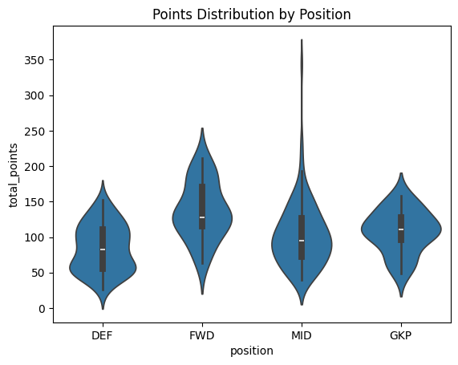

# How are the points distributed for each position?

# Per each position, which scoring category makes up the most points?
## Goalkeeper
| Category      | Avg Pct |
| ------------- | ------- |
| Appearance    | 56.7    |
| Assist        | 0       |
| Clean Sheet   | 30.1    |
| Save          | 28.4    |
| Penalty Save  | 3.7     |
| Goals Against | -37.8   |

Starter is a must. Clean sheets are huge besides that. Secondary considerations after these two are high save volume and low goals against. So look at xGOT and shots against.

## Defender
| Category      | Avg Pct |
| ------------- | ------- |
| Appearance    | 65.0    |
| Assist        | 4.1     |
| Clean Sheet   | 31.3    |
| Goal          | 6.5     |
| Goals Against | -47.6   |

Starter is a must again. Clean sheets and goals against are the basics. The very best also has some additional income from goals and assists but not an absolute must.

## Midfielder
| Category    | Avg Pct |
| ----------- | ------- |
| Appearance  | 49.5    |
| Assist      | 12.2    |
| Clean Sheet | 6.9     |
| Goal        | 18.3    |

Starts are still important but goal involvements are much more of a distinguishing factor. Top players also start picking up consistent BPS points.

## Striker
| Category   | Avg Pct |
| ---------- | ------- |
| Appearance | 38.4    |
| Assist     | 9.5     |
| Goal       | 33.5    |

All about goals for this position. Assists helpful but not essential. BPS points another stable source of income

# What is the level of BPS concentration for each team?

| Team           | Top 3 | Top 5 |
| -------------- | ----- | ----- |
| Arsenal        | 0.355 | 0.577 |
| Aston Villa    | 0.469 | 0.631 |
| Bournemouth    | 0.362 | 0.543 |
| Brentford      | 0.440 | 0.625 |
| Brighton       | 0.346 | 0.525 |
| Chelsea        | 0.409 | 0.602 |
| Crystal Palace | 0.399 | 0.602 |
| Everton        | 0.299 | 0.472 |
| Fulham         | 0.388 | 0.570 |
| Ipswich        | 0.474 | 0.684 |
| Leicester      | 0.312 | 0.491 |
| Liverpool      | 0.437 | 0.610 |
| Man City       | 0.332 | 0.511 |
| Man Utd        | 0.477 | 0.635 |
| Newcastle      | 0.373 | 0.563 |
| Nott'm Forest  | 0.369 | 0.553 |
| Southampton    | 0.407 | 0.605 |
| Spurs          | 0.409 | 0.640 |
| West Ham       | 0.453 | 0.667 |
| Wolves         | 0.491 | 0.662 |
